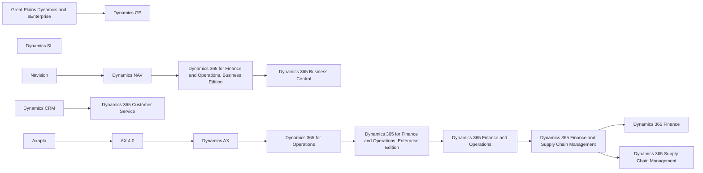

# Microsoft Naming

## Dynamics

```mermaid
graph LR;

    AX[Dynamics AX];
    CRM[Dynamics CRM];
    GP[Dynamics GP];
    NAV[Dynamics NAV];
    SL[Dynamics SL];
    
    CRM-->D365CS[Dynamics 365 Customer Service];
    
    GPD[Great Plains Dynamics and eEnterprise]-->GP;  

    Navision-->NAV-->D365FOB[Dynamics 365 for Finance and Operations, Business Edition]-->D365BC[Dynamics 365 Business Central];
    
    Axapta-->AX4[AX 4.0]-->AX-->D365O[Dynamics 365 for Operations]-->D365FOE[Dynamics 365 for Finance and Operations, Enterprise Edition]-->D365FO[Dynamics 365 Finance and Operations]-->D365FSCM[Dynamics 365 Finance and Supply Chain Management];
    
    D365FSCM-->D365F[Dynamics 365 Finance];
    D365FSCM-->D365SCM[Dynamics 365 Supply Chain Management];
```
