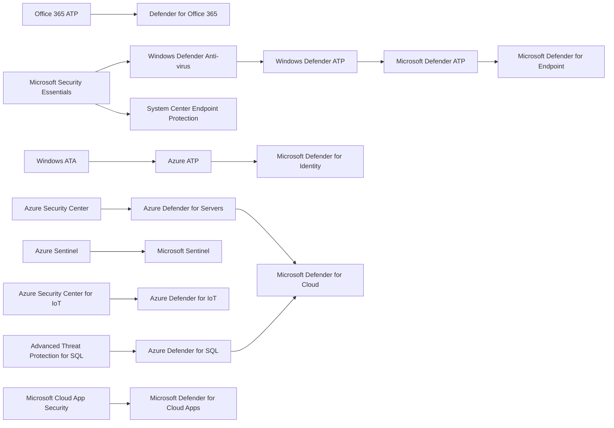
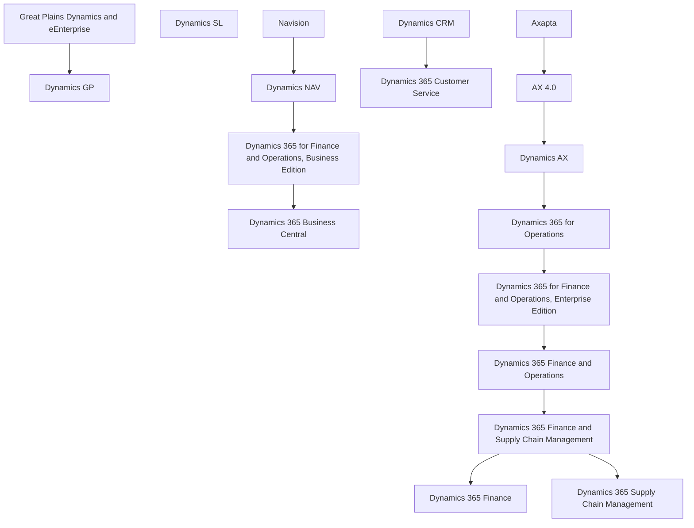

# Microsoft Naming

## Defender

```mermaid
graph LR;

    O365ATP[Office 365 ATP] --> DfO365[Defender for Office 365];
    MSE[Microsoft Security Essentials] --> WDAV[Windows Defender Anti-virus] --> WDATP[Windows Defender ATP] --> MDATP[Microsoft Defender ATP] --> MDfE[Microsoft Defender for Endpoint];
    MSE --> SCEP[System Center Endpoint Protection];
    WATA[Windows ATA] --> AATP[Azure ATP] --> MDfI[Microsoft Defender for Identity];
    ASC[Azure Security Center] --> ADfS[Azure Defender for Servers] --> MDfC[Microsoft Defender for Cloud];
    ASentinel[Azure Sentinel] --> Sentinel[Microsoft Sentinel];
    
    ASCfIoT[Azure Security Center for IoT] --> ADfIoT[Azure Defender for IoT];
    
    ATPfSQL[Advanced Threat Protection for SQL] --> ADfSQL[Azure Defender for SQL] --> MDfC;
    
    MCAS[Microsoft Cloud App Security] --> MDfCA[Microsoft Defender for Cloud Apps];

```

## Dynamics

```mermaid
graph TD;

    AX[Dynamics AX];
    CRM[Dynamics CRM];
    GP[Dynamics GP];
    NAV[Dynamics NAV];
    SL[Dynamics SL];
    
    CRM --> D365CS[Dynamics 365 Customer Service];
    
    GPD[Great Plains Dynamics and eEnterprise]-->GP;  

    Navision-->NAV-->D365FOB[Dynamics 365 for Finance and Operations, Business Edition]-->D365BC[Dynamics 365 Business Central];
    
    Axapta-->AX4[AX 4.0]-->AX-->D365O[Dynamics 365 for Operations]-->D365FOE[Dynamics 365 for Finance and Operations, Enterprise Edition]-->D365FO[Dynamics 365 Finance and Operations]-->D365FSCM[Dynamics 365 Finance and Supply Chain Management];
    
    D365FSCM-->D365F[Dynamics 365 Finance];
    D365FSCM-->D365SCM[Dynamics 365 Supply Chain Management];
```
