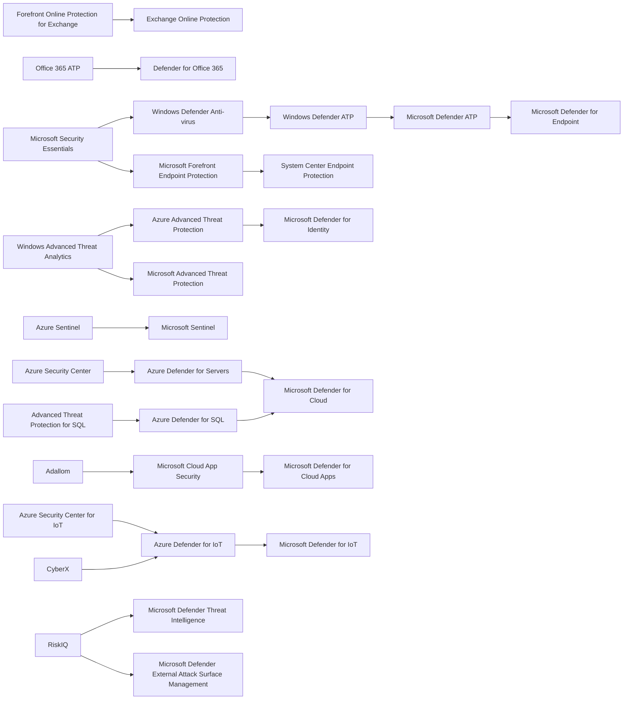
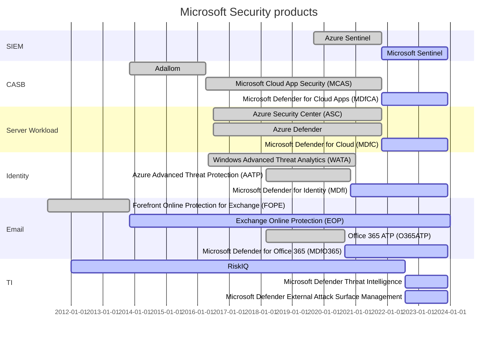
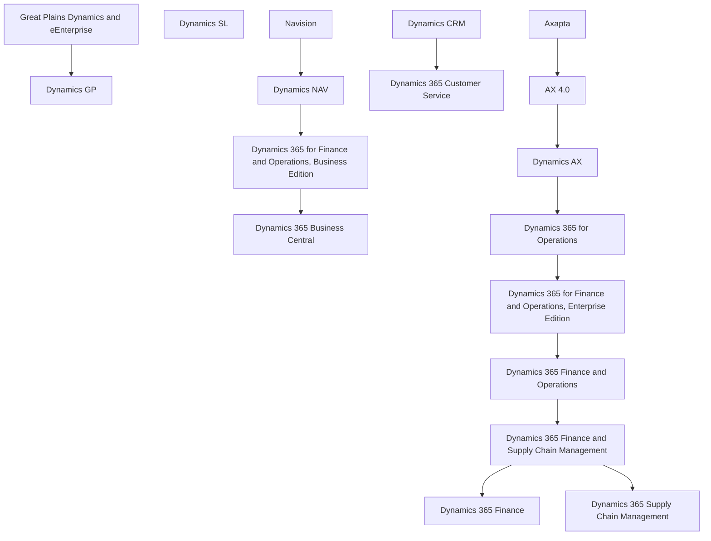
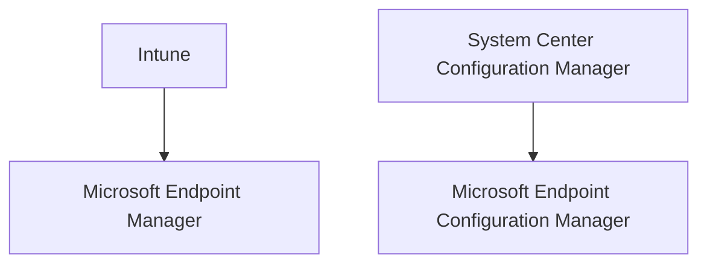
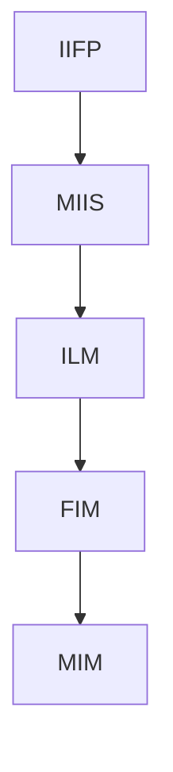

# Microsoft Naming

It's hard to keep a mental model of Microsoft's product renames. So I'm trying to document it in a series of graphs.

Rules:

1. These graphs are about the Product Name only. Integrations between products come and go, and that's a whole other repo waiting to be created.

## Defender

## Dynamics

## Endpoint Management

## Identity

